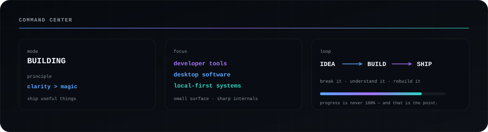
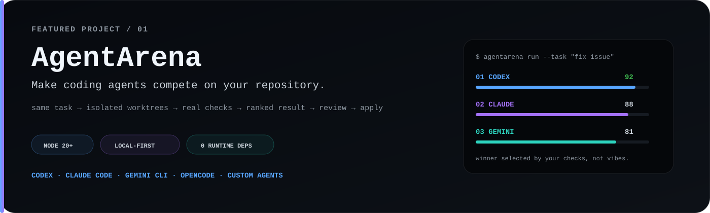
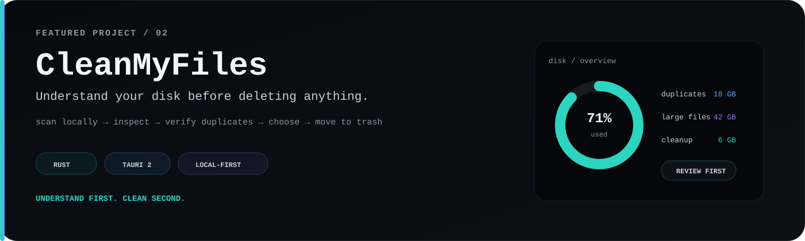
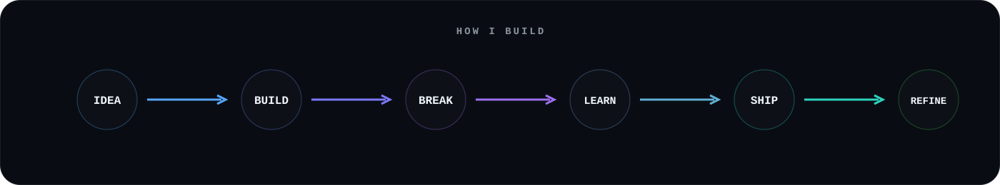
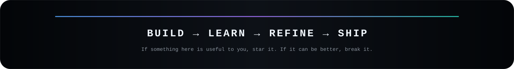

<div align="center">

<a href="https://github.com/hanxww">
  
</a>

<br />


<p>
  <a href="https://github.com/hanxww?tab=repositories">
    
  </a>
  <a href="https://github.com/hanxww/AgentArena">
    
  </a>
  <a href="https://github.com/hanxww/CleanMyFiles">
    
  </a>
</p>

</div>

---

## `01 // SYSTEM`

<a href="https://github.com/hanxww">
  
</a>

I’m **hanxww** — an independent developer building practical open-source software.

I care about **clarity, control, local-first behavior, predictable UX and small dependency surfaces**.  
The interface should stay calm. The internals can do the hard work.

> **Current direction:** tools that solve one concrete problem exceptionally well.

<br />

## `02 // FEATURED BUILDS`

<a href="https://github.com/hanxww/AgentArena">
  
</a>

### [⚔️ AgentArena](https://github.com/hanxww/AgentArena)

Run multiple coding agents against the **same real engineering task**, isolate every attempt, execute your repository checks, compare the results and review the winner before applying anything.

`Codex` · `Claude Code` · `Gemini CLI` · `OpenCode` · `custom agents`

<p>
  <a href="https://github.com/hanxww/AgentArena">
    
  </a>
  
  
</p>

[**→ Enter the arena**](https://github.com/hanxww/AgentArena)

<br />

<a href="https://github.com/hanxww/CleanMyFiles">
  
</a>

### [🧹 CleanMyFiles](https://github.com/hanxww/CleanMyFiles)

A local-first desktop disk analyzer for understanding storage usage, verifying exact duplicates, reviewing large or old files and removing **only what you explicitly choose**.

`Rust` · `Tauri 2` · `BLAKE3` · `local-first`

<p>
  <a href="https://github.com/hanxww/CleanMyFiles">
    
  </a>
  
  
</p>

[**→ See what is taking your disk space**](https://github.com/hanxww/CleanMyFiles)

<br />

## `03 // BUILD LOOP`



<br />

## `04 // TOOLCHAIN`

<div align="center">


<br /><br />

<code>Rust</code>
&nbsp;·&nbsp;
<code>JavaScript</code>
&nbsp;·&nbsp;
<code>Node.js</code>
&nbsp;·&nbsp;
<code>Git</code>
&nbsp;·&nbsp;
<code>GitHub</code>

</div>

<br />

## `05 // SIGNAL`

<div align="center">


<br />


</div>

<br />

## `06 // RULES I BUILD BY`

```text
01  solve the real problem, not the impressive-looking one
02  destructive actions should always be explicit
03  transparent behavior beats hidden magic
04  fewer dependencies are often better dependencies
05  good software should feel obvious after you learn it once
06  ship → observe → improve
```

<br />

<div align="center">

<a href="https://github.com/hanxww/AgentArena">
  
</a>
&nbsp;
<a href="https://github.com/hanxww/CleanMyFiles">
  
</a>

<br /><br />


<br /><br />

<a href="https://github.com/hanxww">
  
</a>

</div>
